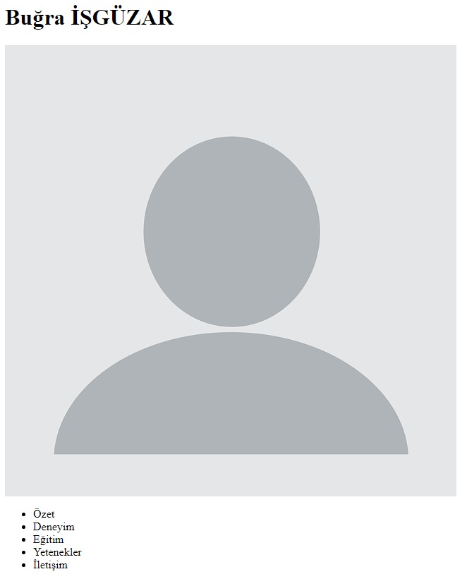

# HTML'i Hazırlayalım

İlk yapacağımız şey HTML sayfamızı hazırlamak olacak. Şekillendirme kısımına daha sonra geçeceğiz. Şimdi daha önce indirip kurduğumuz ya da zaten kullandığımız kod editörü ile *index.html* dosyasını açalım. İçine HTML şablonumuzu yazacağız. Bu noktada kopyala yapıştır yapmanızı önermesem de kabul edilebilir. Ancak buradan sonraki aşamalarda kopyala/yapıştır yazmak yerine dökümandan bakarak kendinizin yazması daha sağlıklı olacaktır. Hatta bazı noktaları değiştirmekten/fazlasını eklemekten çekinmeyin. Eğer bu dökümanı bir etkinlikte uyguluyorsanız zaten sizinle ilgilenen deneyimli birisi var demektir. Olası bir hata durumunda ona danışabileceğinizi aklınızdan çıkarmayın. Eğer dökümanı evde uyguluyorsanız olası bir durumda Twitter üzerinden [**@bugraisguzar**](www.twitter.com/bugraisguzar) (bu dökümanı hazırlayan *Kodlama Gönüllüleri* gönüllüsü) ile iletişime geçerek sorularınızı sorabilirsiniz. Ya da **ben@bisguzar.com** adresine mail atabilirsiniz.

~~~html
<html>
<head>
	<title>Ben Buğra İşgüzar</title>
	<link rel="stylesheet" href="style.css">
</head>
<body>

</body>
</html>
~~~

Başlangıç için *index.html* sayfamızı bu şekilde düzenleyelim. Ben *title* yani başlık kısımına kendi adımı yazmayı tercih ettim. Siz de kendi adınızla değiştirebilir, *benim sitem, ilk sitem* gibi istediğiniz herhangi bir başlığı koyabilirsiniz. Yaratıcılığınıza kalmış!

Burada dikkat etmemiz geken kısım `<link rel="stylesheet" href="style.css">` satırı. bu satırda CSS dosyamızı çağırdığımızı daha önce öğrenmiştik. HTML ile CSS dosyalarımız aynı dizinde bulunduğu için *href* niteliğine direk dosyanın adını değer olarak verebiliriz. Şimdi sayfamızın içeriğini oluşturmaya başlayabiliriz. Bu aşamadan sonra yazdığımız kodların tamamını *body* etiketinin içeriği olarak yazacağız.

Buradan sonra öncelikle ne yapacağımızdan bahsedeceğiz ve daha sonra hazırladığımız kodu göreceğiz. Lütfen hazır koda bakmadan önce kendiniz yazmak istemiyorsanız bile aklınızda hangi etiketleri nasıl ve nerede kullanacağınızı hayal edin. Böylelikle bilgilerin kalıcılığı yüksek oranda artacaktır. Bu tamamen sizin öğrenme yöntemlerinize göre değişiklik gösterecektir ancak dökümana katılım gösterirseniz kalıcılık kesinlikle artacaktır.

Öncelikle sayfamızın bir başlık kısımı olacak o yüzden bir *header* etiketi oluşturalım. Bu etiketin içine de önce *h1* etiketi ile adımızı soyadımızı yazalım altına da fotoğrafımızı koyalım. Onun altına da bir menü listesi oluşturalım. Menümüzü daha sonra işlevsel hale getireceğiz, şimdilik sadece şablonumuzu hazırlayalım. Menümüzde bulunacak elemanlar;

* Özet
* Deneyim
* Eğitim
* Yetenekler
* İletişim

Hadi şimdi sayfamızın *header*ini yani başlık kısımını hazırlayalım.

~~~html
<header>
	<h1>Buğra İŞGÜZAR</h1>
	
	<ul>
		<li>Özet</li>
		<li>Deneyim</li>
		<li>Eğitim</li>
		<li>Yetenekler</li>
		<li>İletişim</li>
	</ul>
</header>
~~~

Burada adınızı soyadınızı düzenlemeyi unutmayın. Şimdi tarayıcımızdaki çıktıya bakalım.

Evet istediğimiz çıktıyı alıyoruz. Fotoğrafın çok büyük olması dikkat çekmiş olabilir, boyutlarını daha sonra CSS ile düzenleyeceğiz. Şimdi menüde oluşturduğumuz kısımların içeriklerini oluşturmaya başlayalım. Header kısımını bitirdiğimize göre sayfamızın içeriğini oluşturmaya başlıyoruz demektir. Ana içeriği de *main* etiketi içine yazacağız. Menüdeki her elemanı bir bölüm olarak ayıracağız ve bu yüzden *section* etiketi ile her bölümün sınırlarını belirleyeceğiz. Dolayısıyla *main* etiketi içinde *section* etiketleri olacak. Öncelikle özet kısımını oluşturalım. Bir *section* etiketi oluşturalım ve onun içine de *h2* etiketi ile **Özet** başlığı atalım. Daha sonrasında da bir paragraf oluşturalım ve kendimiz hakkında kısa bir özet yazalım. En son etiketleri kapattığımızdan emin olalım.

~~~html
<main>
	<section>
		<h2>Özet</h2>
		
Yazılıma meraklı bir sağlıkçıyım. Aynı zamanda gezmeyi/organizasyonlarda görev almayı seviyorum.

	</section>
</main>
~~~

Bu kısımları kendimize göre düzenlemeyi, kendi özetimizi yazmayı unutmayalım. İstediğiniz kadar uzatabilir, hatta belki birkaç resim ekleyebilirsiniz. Şimdi de deneyim kısımını oluşturalım.

~~~html
	<section>
		<h2>Deneyim</h2>
		<ul>
			<li>
				<b>Simaka Türkiye</b> 
				<small>Web Developer</small>
				 
				Aralık 2017 - Haziran 2018 
			</li>

			<li>
				<b>bisguzarcom</b> 
				<a href="www.bisguzar.com">bisguzar.com</a> 
				<small>Yazar</small>
				 
				Ağustos 2017 - Halen 
			</li>
		</ul>
	</section>
~~~

Bu bölümün de yine *main* etiketinin içinde olacağını unutmayalım. Kendinize göre düzenleyip yeni deneyimler ekleyebilir, fazlasını silebilirsiniz. Şimdi eğitim bilgilerimizi içerecek kısımı oluşturalım.

~~~html
	<section>
		<h2>Eğitim</h2>
		<ul>
			<li>
				<strong>Marmara Üniversitesi</strong> 
				<a href="https://www.marmara.edu.tr/" itemprop="url">marmara.edu.tr</a> 
				İlk ve Acil Yardım
				 
				2018 - Halen 
			</li>
		</ul>
	</section>
~~~

Bu kısımı da kendi bilgililerinizle oluşturduğunuzu varsayarak devam edelim. Sırada yetenekler bölümümüz var.

~~~html
	<section>
		<h2>Yetenekler</h2>
		<ul>
			<li>
				Python/Flask
			</li>
			<li>
				Sqlite/MongoDB
			</li>
			<li>
				HTML/CSS
			</li>
			<li>
				Cyclist
			</li>
		</ul>
	</section>
~~~

Bu bölümleri oluştururken her birini *section* etiketi içinde yazacağımızdan bahsetmiştik. Her section yani bölümün de içinde ne olduğunu belirten başlıklar yazdık farkettiğiniz gibi. Daha sonra da o bölümün içeriğini. Şimdi son olarak iletişim bölümümüzü de oluşturup sayfamızın HTML kısımına son verelim.

~~~html
	<section>
        <h2>İletişim</h2>
        <ul>
            <li>
                <a href="mailto:ben@bisguzar.com">E-mail</a>
            </li>
            <li>
            	<a href="www.twitter.com/bugraisguzar">@bugraisguzar</a>
            </li>
        </ul>
    </section>
~~~

Burada dikkatinizi çeken bir kısım olmalı. e-mail yazısına bağlantı verirken *a* etiketine *href* değeri olarak **mailto:ben@bisguzar.com** adresini verdik. Ancak bunun bir web adresi olmadığını görebiliyoruz. Bu da *a* etiketinin özelliklerinden biri. *mailto* yapısı ile kullandığımızda bu bağlantıya tıklayan kişinin varsayılan e-mail programı (windowsda genellikle outlook) açılacak ve *ben@bisguzar.com* adresine mail göndermek için pencere çıkacak.

HTML sayfamızın son halini kontrol edelim.

~~~html
<header>
	<h1>Buğra İŞGÜZAR</h1>
	
	<ul>
		<li>Özet</li>
		<li>Deneyim</li>
		<li>Eğitim</li>
		<li>Yetenekler</li>
		<li>İletişim</li>
	</ul>
</header>
<main>
	<section>
		<h2>Özet</h2>
		
Yazılıma meraklı bir sağlıkçıyım. Aynı zamanda gezmeyi/organizasyonlarda görev almayı seviyorum.

	</section>
	<section>
		<h2>Deneyim</h2>
		<ul>
			<li>
				<b>Simaka Türkiye</b> 
				Web Developer
				 
				Aralık 2017 - Haziran 2018 
			</li>
			<li>
				<b>bisguzarcom</b> 
				<a href="www.bisguzar.com">bisguzar.com</a> 
				Yazar
				 
				Ağustos 2017 - Halen 
			</li>
		</ul>
	</section>
	<section>
		<h2>Eğitim</h2>
		<ul>
			<li>
				<strong>Marmara Üniversitesi</strong> 
				<a href="https://www.marmara.edu.tr/" itemprop="url">marmara.edu.tr</a> 
				İlk ve Acil Yardım
				 
				2018 - Halen 
			</li>
		</ul>
	</section>
	<section>
		<h2>Yetenekler</h2>
		<ul>
			<li>
				Python/Flask
			</li>
			<li>
				Sqlite/MongoDB
			</li>
			<li>
				HTML/CSS
			</li>
			<li>
				Cyclist
			</li>
		</ul>
	</section>
	<section>
        <h2>İletişim</h2>
        <ul>
            <li>
                <a href="mailto:ben@bisguzar.com">E-mail</a>
            </li>
            <li>
            	<a href="www.twitter.com/bugraisguzar">@bugraisguzar</a>
            </li>
        </ul>
    </section>
</main>
~~~

Yazdıklarımızı *index.html* dosyasına kayıt edelim ve bu dosyayı bir tarayıcı ile açıp kontrol edelim. Evet HTML ile işimizi *şimdilik* bitirdik, bir sonraki bölüme geçelim ve sayfamızı CSS ile biraz güzelleştirelim.
